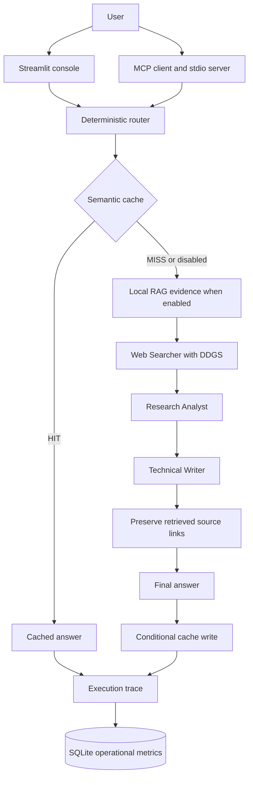

# Multi-Agent Deep Researcher

A local-first research system combining three sequential CrewAI agents, an MCP interface, Ollama inference, local RAG, semantic caching, deterministic model routing, structured observability, and a Streamlit Research Execution Console. DDGS supplies live web evidence; local documents supply attributed knowledge.

The project explores an engineering question: how can a local research pipeline reuse answers, select models transparently, preserve evidence, and make its execution measurable? It pairs a working application with reproducible evaluation and explicit limits on what its results establish.

## Key features

| Capability | Implementation |
| --- | --- |
| Multi-agent research | Web Searcher retrieves evidence; Research Analyst synthesizes it; Technical Writer produces a Markdown answer. |
| Real web search | Request-owned DDGS tool records actual searches, results, URLs, and failures. |
| Local RAG | Explicit PDF/TXT/Markdown ingestion, Qwen3 embeddings, persistent Chroma, and filename/page citations. |
| Semantic cache | Exact and semantic answer reuse, one-hour TTL, strict similarity **>0.97**, and scope/intent compatibility checks. |
| Model routing | Deterministic v1 complexity policy with Auto/Fast/Quality controls; no routing model call. |
| Observability | Routing, cache decisions, evidence, agent task outputs, stage timings, model identities, and tokens when reported. |
| Research console | Streamlit Research tab exposes the answer and observable execution details. |
| Analytics | SQLite operational history tracks latency, routes, cache hits, RAG, and DDGS usage. |
| Evaluation | Versioned Phase 10 datasets separate offline checks, controlled evidence, and live web validation. |
| MCP | Stdio server exposes exactly one tool, `crew_research(query: str) -> str`. |

## Architecture



DDGS executes inside the Searcher's task. RAG retrieves evidence before Crew kickoff; it is infrastructure rather than another agent. A cache hit skips document retrieval, DDGS, and all three agent executions, while still recording a trace and metrics. RAG-enabled lookups read the corpus fingerprint for compatibility. Both interfaces share `agents.py`; Streamlit does not call the MCP server.

See [the subsystem architecture](docs/architecture.md) for stores, Ollama models, exact HIT/MISS flows, failures, and engineering decisions.

## Research Execution Console

The **Research** tab shows Execution Summary, Routing Decision, Semantic Cache, RAG Evidence, Web Search Results, Web Searcher Output, Research Analyst Output, Technical Writer Output, Execution Timings, token usage, Request Details, and the Final Research Answer. Agent outputs are returned task deliverables; hidden chain-of-thought and provider messages are not exposed.

**Real-time stage progress:** while research runs, a live status panel updates routing, cache, RAG, actual DDGS searches, Searcher/Analyst/Writer completion, and finalization. Cache hits explicitly skip retrieval and agents; disabled RAG is marked skipped, and fallback failures remain visible. This is stage/event streaming, not token streaming: the final answer appears after execution finishes, and hidden chain-of-thought is never exposed. The full execution console still renders after completion.

The **Analytics** tab shows total requests, successes/failures, cache hit rate, FAST/QUALITY counts, RAG/DDGS usage, average/P50/P95 latency, and the latest 20 operational requests. Its summary covers all stored requests. Cache hit rate excludes disabled, bypassed, and failed lookups. The latest rich trace stays in the browser session; Analytics does not archive full answers or traces.

## Model routing

Auto uses policy **v1**: score **<3 → FAST/SIMPLE**, score **≥3 → QUALITY/COMPLEX**. Lexical signals include comparisons, trade-offs, evaluation, recommendations, multiple actions, and query length. Manual overrides select the route directly; the displayed SIMPLE/COMPLEX label follows that selected route.

| Route | Web Searcher | Research Analyst | Technical Writer |
| --- | --- | --- | --- |
| FAST | `ollama/qwen2.5:3b` | `ollama/qwen3:1.7b` | `ollama/qwen3:1.7b` |
| QUALITY | `ollama/qwen2.5:3b` | `ollama/qwen2.5:3b` | `ollama/qwen2.5:3b` |

The Searcher stays on Qwen2.5 3B because its CrewAI/DDGS tool calling was validated. FAST denotes the intended smaller-model synthesis route; it does not establish lower latency. Neither route adds a judge, escalation, or second generation pass.

## Measured evaluation

All numbers below derive from the committed [Phase 10 report](docs/benchmarks/phase10_baseline.md) and [baseline JSON](evaluation/results/phase10_baseline.json), measured on the recorded local Windows setup.

| Evaluation | Sample | Measured result |
| --- | --- | --- |
| Router | 36 curated queries | **100% policy-conformance accuracy**; 18 FAST and 18 QUALITY, no off-diagonal cases. |
| Semantic cache | 20 curated pairs: 10 positive, 10 negative | **100% precision, 40% recall, 70% accuracy**; TP=4, TN=10, FP=0, FN=6. |
| RAG retrieval | Controlled synthetic corpus: 6 documents, 10 queries | **100% Hit@1, 100% Hit@4, MRR 1.0**; mean retrieval latency **50.32 ms**. |
| Cache end-to-end | **One measured Phase 10 paraphrase pair** | **32.91 s → 32.98 ms**, **997.95× speedup**, **99.90% latency reduction**. |
| RAG integration | One controlled request | Retrieved `project_meridian.md` and propagated `Cedar-47` into the answer with local attribution. |

The conservative cache threshold avoided measured false positives but missed six valid paraphrases. Router results measure agreement with the curated policy labels. RAG results measure retrieval on the small synthetic corpus. The cache speedup applies only to the recorded pair: it avoided one Crew and four fixed-evidence DDGS tool calls; RAG was disabled in both requests.

| Controlled route | N prompts | Mean total latency | Mean reported total tokens | Deterministic rubric coverage |
| --- | --- | --- | --- | --- |
| FAST | 2 | 36.47 s | 6,477.5 | Full on both prompts |
| QUALITY | 2 | 28.26 s | 4,449.5 | Full on both prompts |

**The sample is too small to conclude that either route is generally faster or better. In this run, QUALITY was faster and used fewer reported tokens.** Mean and median latency coincide for these two-sample groups. Rubric coverage checks concept substrings; it does not establish factual correctness or human-equivalent answer quality. Model warmth, execution order, local load, and stochastic generation affect timing.

Single live-web validation request: AUTO selected FAST, one real DDGS call returned five results, total latency was **44.61 s**, and reported usage was **5,281 tokens**. This is one observation, not average application latency or an availability estimate.

## Technology stack

Python 3.11 (validated with 3.11.9), CrewAI, MCP Python SDK/FastMCP, Ollama/Qwen, DDGS, ChromaDB, Streamlit, pypdf, Pydantic, AnyIO, python-dotenv, standard-library SQLite, and pytest for validation. [requirements.txt](requirements.txt) pins direct runtime dependencies; CrewAI provides the research model client and the Python Ollama client provides embeddings.

## Quick start

Run from the repository root. Windows PowerShell is the validated environment:

```powershell
py -3.11 -m venv .venv
.\.venv\Scripts\Activate.ps1
python -m pip install -r requirements.txt
```

If activation is blocked, substitute `.\.venv\Scripts\python.exe` for `python`. Equivalent POSIX commands are `python3.11 -m venv .venv` and `source .venv/bin/activate`; Linux/macOS validation is not claimed.

Install [Ollama](https://ollama.com/download), start it, and pull all required models:

```powershell
ollama pull qwen2.5:3b
ollama pull qwen3:1.7b
ollama pull qwen3-embedding:0.6b
```

The application uses `http://localhost:11434`. If the Ollama service is not running, use `ollama serve` in another terminal. Model downloads and DDGS web search require internet access. No search API key or `.env` file is required; an optional local `.env` can be loaded by python-dotenv.

## Usage

### Streamlit

```powershell
python -m streamlit run app.py
```

Open `http://localhost:8501`. Ask a question, optionally add documents, choose **Use local knowledge base**, **Use semantic cache**, and **Model route**, then select **Research**. Inspect the evidence, task outputs, answer, and Analytics. Research executes only on form submission; tab changes and analytics refresh do not start another request. Stop with Ctrl+C.

### Document ingestion

In the **Knowledge Base** sidebar, select PDF, TXT, or MD files, then explicitly click **Add to Knowledge Base**. Selecting uploads alone does not ingest them. Ollama embeds chunks into local Chroma; **Stored chunks** reports the corpus size. Temporary raw uploads are removed after processing. TXT/Markdown must be UTF-8; PDFs need extractable text because there is no OCR. Citations preserve filename and actual PDF page when available.

### MCP

```powershell
python server.py
```

This starts a stdio MCP server that waits for a client's JSON-RPC messages. Configure the client to launch the repository's virtual-environment interpreter with `server.py` as its argument and the repository as its working directory. Clients requiring absolute launch paths must resolve those paths on their own machine. The only tool is `crew_research(query: str) -> str`; it uses Auto routing and the same local corpus/cache. Keep Ollama running. [Architecture details](docs/architecture.md#mcp-interface) explain worker-thread isolation and stdout protection.

## Tests and evaluation reproduction

Install pytest in the development environment if it is absent (it is not a pinned runtime requirement):

```powershell
python -m pip install pytest
python -m pytest -q
python -m pip check
python -m evaluation.cli --help
python -m tests.smoke_interfaces
```

The regression suite uses fake research/embeddings and temporary stores; it makes no real model generation or DDGS calls. Interface smoke checks Streamlit HTTP and MCP initialization/tool discovery without invoking research. The final Phase 11 suite passed **215 tests and 20 subtests**; existing CrewAI deprecation warnings remain.

[Evaluation reproduction](docs/evaluation.md) provides exact offline, controlled, live-web, and report-only commands. Offline evaluation requires real local embeddings; controlled/live-web suites also generate research and are optional. Reading the committed results requires no benchmark run.

## Repository structure

```text
agents.py          Canonical research pipeline, Crew tasks, DDGS tool
server.py          MCP stdio interface
app.py             Streamlit entry point and explicit ingestion controls
routing/           Deterministic policy and model identities
rag/               Loaders, chunking, embeddings, Chroma, bounded context
semantic_cache/    Exact/semantic lookup, TTL, scope, separate Chroma store
observability/     Execution recorder, typed traces, SQLite metrics
ui/                Research console, analytics, formatting
evaluation/        Versioned datasets, fixtures, harness, committed results
tests/             Offline regression tests and opt-in smoke checks
docs/              Architecture, demo, portfolio, evaluation, benchmark report
```

## Privacy and local-first operation

Generation and embeddings execute through local Ollama. RAG chunks, cache entries, Chroma, and SQLite metrics stay in local storage. **DDGS web queries leave the machine when web search runs.** Local-first operation is not fully offline research.

SQLite metrics store SHA-256 query hashes and operational metadata, excluding raw queries, final answers, agent outputs, RAG text, and web snippets. A hash is an identifier, not encryption. The separate semantic cache retains queries and answers, and the RAG store retains document chunks. Runtime data and optional secrets are Git-ignored. Rich traces remain session-scoped; existing verbose CrewAI execution can print output to the terminal/stderr.

## Limitations

- The router is a lexical heuristic and can misread unfamiliar phrasing or non-English requests; manual route selection is available.
- Cache recall was only **40% on the curated 20-pair set**. Intent guards are incomplete, TTL bounds age rather than detecting web changes, and expired entries have no automatic pruning or storage cap.
- RAG evaluation used only six synthetic documents and ten queries. There is no OCR, automatic document replacement/version management, or atomic multi-batch ingestion. Changed uploads can leave older chunks; corpus fingerprinting reads the full corpus.
- Rich traces are session-scoped; metrics have no retention policy. Analytics aggregates local history in memory. Per-agent timing is not collected, and token availability depends on CrewAI/provider reporting.
- Source-link preservation and substring rubrics do not verify every claim. Generated answers and citations require source review.
- Hardware, model warmth, local load, and the network affect performance. FAST was not empirically faster in the tiny Phase 10 sample; that sample cannot establish general route quality or latency.

## Documentation

- [Architecture and engineering decisions](docs/architecture.md)
- [3–5 minute demo and screenshot checklist](docs/demo.md)
- [Portfolio, resume bullets, and interview talking points](docs/portfolio.md)
- [Evaluation methodology and reproduction](docs/evaluation.md)
- [Authoritative Phase 10 report](docs/benchmarks/phase10_baseline.md) / [JSON](evaluation/results/phase10_baseline.json)
- [Release notes](CHANGELOG.md)

The base workflow draws on [the AI Engineering Hub reference project](https://github.com/patchy631/ai-engineering-hub/tree/main/Multi-Agent-deep-researcher-mcp-windows-linux). This repository extends it with DDGS, local Qwen routing, RAG, cache, observability, the execution console, and measured evaluation. No repository license is currently declared.
