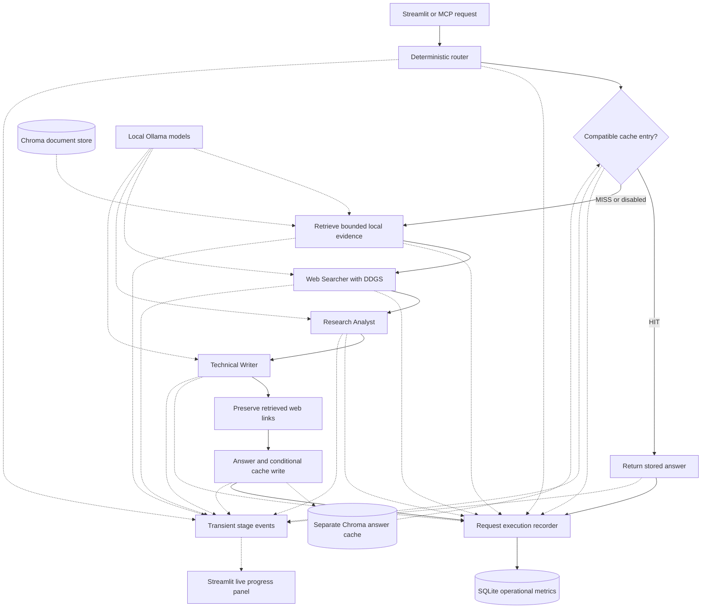

# Architecture

Both interfaces share the canonical implementation in `agents.py`. `run_research_detailed()` returns a typed `ResearchExecutionResult`; `run_research()` delegates to it and returns `final_answer` for the MCP string API.

## Research pipeline and stores

Solid arrows show execution or result flow; dotted arrows show storage/model dependencies and observation. Semantic cache lookup/save also use Ollama embeddings when needed. The recorder captures decisions, RAG evidence, actual web calls, public task outputs, timings, and reported tokens.

**Normal MISS flow:** question → route once → construct RAG service/read scope fingerprint when enabled → cache lookup → RAG retrieval → Crew kickoff → Searcher/DDGS → Analyst → Writer → preserve missing retrieved links → final answer → eligible cache write → finish trace → persist metrics. An empty cache is labelled `EMPTY`; a disabled cache skips lookup/write. DDGS is a tool invoked during the first Crew task, not a separate pre-Crew stage.

**HIT flow:** question → route once → compatible scope/cache lookup → stored final answer → finish trace → persist metrics. Crew construction/kickoff, DDGS, document retrieval, and generation are skipped. With RAG enabled, service construction and corpus fingerprinting still precede the hit. Exact hits need no embedding; semantic hits require a query embedding. Model assignments describe the selected route even when agents do not execute.

## Model routing

`routing/router.py` uses string/regex rules with policy `v1`. Length contributes +1 at 30 words and +1 more at 80; comparison and trade-offs contribute +2 each; evaluation/risk analysis and recommendation/system design contribute +3 each; multiple sources and multiple actions contribute +1 each. Each category contributes at most once. Auto chooses QUALITY at score ≥3 and FAST otherwise. Manual overrides retain the score/reasons while forcing the route.

| Route | Searcher | Analyst / Writer |
| --- | --- | --- |
| FAST | `ollama/qwen2.5:3b` | `ollama/qwen3:1.7b` |
| QUALITY | `ollama/qwen2.5:3b` | `ollama/qwen2.5:3b` |

Keeping Searcher fixed preserves validated tool use. Deterministic selection avoids another model request and makes decisions reproducible and inspectable. There is no runtime judge or escalation. FAST names the smaller synthesis route; its label makes no empirical latency guarantee. Displayed SIMPLE/COMPLEX follows the selected route, including overrides.

## Semantic cache

`semantic_cache/` stores queries, normalized queries, final answers, explicit vectors, creation/expiry timestamps, and typed scope in a separate Chroma collection. Exact normalization collapses whitespace while preserving case, punctuation, and identifiers. Lookup checks exact identity first, then embeds only if live compatible entries exist. The best semantic candidate must pass **strict cosine similarity >0.97**, TTL, scope, and a lexical polarity/intent/numeric guard.

The one-hour TTL limits reuse of web-derived answers. Scope includes cache version `2`, router policy, selected route, Searcher/synthesis model identities, embedding model, and RAG mode. RAG scope additionally includes a SHA-256 fingerprint of stored IDs/text/citation metadata, retrieval settings, and context limits. Web-only scope is distinct. Auto and manual modes selecting the same route can reuse answers; FAST and QUALITY cannot cross-hit.

After successful complete task outputs, eligible nonempty/error-free answers are saved. RAG fallback answers are excluded. The corpus scope is checked again before writing so changes during research skip a stale write. Lookup/write failures warn and preserve research availability. Expired entries remain on disk. Precision was 100% and recall 40% on the curated 20-pair Phase 10 set; the conservative threshold sacrifices reuse opportunities and cannot guarantee safe reuse for every intent.

## Local RAG

`rag/` loads extractable PDF pages and UTF-8 TXT/Markdown, uses deterministic 1,000-character windows with 200-character overlap, embeds through `qwen3-embedding:0.6b`, and upserts explicit vectors into embedded Chroma. PDF page numbers start at 1; chunk indices start at 0. Text documents have no page number. No automatic Chroma embedding function or OCR is used.

Research retrieves top-k **4**, accepts finite cosine distance **≤0.6**, and formats at most **6,000 context characters**, with at most **1,000 characters per chunk**. The Analyst and Writer receive the same local evidence with exact citation strings, alongside task context. Empty corpora skip query embedding. Disabled/irrelevant RAG adds no local evidence; failures preserve web research and append an explicit fallback notice.

The app anchors storage to `data/chroma/`. Unchanged uploads with the same filename upsert stable IDs. Changed documents can leave old chunks; filenames share source identity and ingestion batches are not atomic. Disabling research-time RAG does not disable explicit ingestion or the sidebar's corpus count.

## Web search and agent orchestration

The request owns a new `DuckDuckGoSearchTool`, preserving its own calls/results/URLs, including empty/error calls. Standard depth requests up to five results; deep requests up to ten. The Searcher has tool access, while Analyst/Writer consume provided evidence. CrewAI executes exactly three tasks sequentially with delegation disabled. Analyst context includes Searcher output; Writer context includes Searcher and Analyst outputs. Local RAG is not a fourth agent.

Ollama generation uses `http://localhost:11434` and a 2,048-token output limit per model call. Prompts request focused, attributed answers; they do not guarantee factual correctness. If synthesis omits observed web URLs, `_with_search_sources()` appends only those exact missing URLs without new search or generation. The Writer's raw task output can therefore differ from the postprocessed final answer.

## Observability and metrics

`ExecutionRecorder` belongs to one request, keeping concurrent tool traces independent. It copies only public task `raw` outputs and validated usage counters; prompts, provider messages, hidden chain-of-thought, and embeddings are excluded from the rich trace. Failures retain available completed outputs and identify unavailable/error stages.

Routing, cache, RAG, web, Crew, and total timings use `perf_counter`. `None` means a stage did not execute. Web time is included in Crew time, so stage timings are not additive. Total includes setup and cache writes but excludes metrics persistence. There is no per-agent timing. Token counters remain unavailable when absent, default-zero, or inconsistent; no estimated token counts or API-dollar savings are inserted.

`MetricsStore` uses standard-library SQLite at `data/metrics/research_metrics.db`: schema version 1, timestamp index, WAL, parameterized inserts, and short-lived connections. A separate column allowlist persists query SHA-256/length, timestamps/status, routes/models, cache/RAG/web counters, timings, nullable usage, and error type. Raw queries, answers, agent outputs, RAG text, and web snippets/URLs are excluded. Hashes are identifiers rather than encryption. Metrics errors preserve answers and emit only exception-type warnings in the trace.

Analytics covers all operational rows, with the latest 20 displayed separately. Cache hit rate divides hits by eligible `EMPTY`, `MISS`, `EXACT_HIT`, and `SEMANTIC_HIT` lookups. Latency aggregates include successes and failures with measured totals; P50/P95 use linear interpolation. There is no retention policy or full trace archive.

## Streamlit interface

`run_research_detailed(..., progress_callback: Callable[[ExecutionProgressEvent], None] | None = None)` remains the single pipeline. `observability/progress.py` defines stages `ROUTING`, `CACHE`, `RAG`, `WEB_SEARCH`, `WEB_SEARCHER`, `ANALYST`, `WRITER`, `FINALIZING`, and `COMPLETE`, with `STARTED`, `COMPLETED`, `SKIPPED`, and `ERROR` statuses. Events carry the request ID, UTC timestamp, safe message, optional measured duration, and allowlisted scalar metadata. They are transient and are not written to SQLite. The final execution result and metrics remain authoritative.

Routing/cache/RAG events reuse actual decisions and retrieval evidence. DDGS emits at the real tool invocation boundary, including each separate call and fallback failure, without another search. CrewAI 1.15.21's public `Task.callback` marks Searcher completion/Analyst start, Analyst completion/Writer start, and Writer completion. Existing task callbacks (including async callbacks) and Crew callbacks are preserved without duplicate invocation; no thought callbacks, stdout scraping, or private Crew state are used. Finalization includes source preservation, eligible cache writes, result assembly, and metrics persistence. Fatal errors emit the reliably known active stage and an overall failure; fallback errors can precede successful completion.

Cache hits emit explicit skipped events for RAG, web search, and all agents. Disabled RAG is skipped. An uninvoked DDGS tool is marked skipped after Crew completion. Missing public task outputs are marked unavailable rather than invented. There are no per-agent timing estimates. If the progress sink raises, its exception type becomes one safe result warning, the sink is disabled, and research continues with the same external error/answer semantics. No event prints to stdout. Callers without a callback and the MCP string API retain their behavior.

`ui/progress.py` creates a native `st.status` panel with text placeholders immediately on form submission. It invokes the canonical backend once in a worker and uses a thread-safe queue to render events on the Streamlit script thread, including events from CrewAI's batched tool workers. No worker touches Streamlit or session state; the emitter serializes concurrent sink access. State symbols plus text show pending/running/completed/skipped/error states; failed searches remain visible if another invocation succeeds. The final answer is rendered only after the pipeline returns and queued events are drained. This is stage/event streaming, not token streaming; prompts, embeddings, provider messages, hidden reasoning, and partial Writer text never enter events. The panel lasts for that script run, while the existing rich result remains in session state across navigation and reruns.

`app.py` handles the form, route/cache/RAG controls, explicit upload ingestion, and session state. `ui/` separates research rendering, analytics, and pure formatting. Only research form submission executes the pipeline; navigation/refresh reruns do not generate another answer. The latest rich trace remains in that session until replaced or the session ends. Analytics reads SQLite operational history independently.

Uploads are staged in an OS temporary directory and removed after processing, including failures. Embedded chunks persist locally. Console sections expose evidence and task deliverables with explicit bypass/unavailable states. Native Markdown tables avoid dataframe/chart loading; production UI design is unchanged by portfolio documentation.

## MCP interface

`python server.py` launches FastMCP's stdio transport with exactly `crew_research(query: str) -> str`. It calls the same string wrapper with default Auto routing, RAG, and caching. It provides no ingestion tool or route argument.

Research runs in an AnyIO worker thread under a lock because stdout redirection is process-wide. CrewAI prints are redirected to stderr, and event handlers are flushed before stdout is restored. Stdout stays reserved for JSON-RPC. The protocol smoke initializes the server, lists the sole tool, closes stdin, and verifies exit 0 without calling research.

## Evaluation and design decisions

`evaluation/` exercises the frozen APIs with versioned fixtures, dedicated stores, atomic checkpoints, source/configuration identity, bounded research/Crew reservations, and no automatic retry of failed/interrupted cases. Offline checks measure policy conformance and real-embedding cache/RAG behavior. Controlled evidence isolates network variability, while a separate single live-web case checks the real DDGS boundary. Normal pytest uses fakes; opt-in research smoke modules are separate.

The main decisions are a deterministic router for transparent selection, strict guarded caching to favor precision, local Ollama for inference, a fixed tool-capable Searcher, Chroma for embedded explicit-vector persistence, and SQLite for operational history without another service. Request-scoped traces prevent evidence mixing; separating rich traces from persistent metrics limits analytics content. Public deliverables make execution inspectable without exposing hidden reasoning. Controlled and live-web measurements answer different questions and are never pooled.

See [evaluation reproduction](evaluation.md), [the authoritative benchmark](benchmarks/phase10_baseline.md), and [portfolio lessons](portfolio.md).
